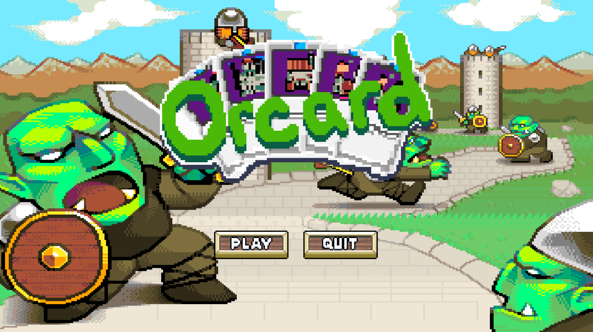

# Orccard

This is one of the first _real_ attempts I made at making a full game with Unity. I wanted to
combine two genres that I hadn't seen mixed yet: Deck-building and Tower Defense. The idea was that
you'd play a card game against a world that doesn't pause which means that you have to play well and
quickly to stay ahead of the ramping difficulty of each wave of Orcs.

Unfortunately, this is mostly abandoned at this point. It was a very large project and I wasn't sure
it was worth gambling another 1-3 years of development on it. The nail in the coffin was when
I found another game being worked on by an entire team that was very similar conceptually: [ORX](https://store.steampowered.com/app/1071140/ORX/). ORX seems,
to me, to be a very similar idea done with a production value I couldn't hope to compete with as
a single person. I told myself I'd play it when its released and if it doesn't do what I was hoping
to with Orrcard then I might revisit this project.

That said, I learned plenty about making games from this project and had several systems I was
fairly proud of:

- The targetting system is robust and pretty neat. It allows the player to target cards in their
  hand, units on the field, tiles on the board, etc. This allowed for a very powerful:
- Data-driven card system that was entirely handled through scriptable objects. Creating new cards
  was as simple as putting together various abilities and effects on a card and customizing their
  costs and values. Additionally, you could adjust when/how these effects triggered. Gain gold when
  you draw this card, draw 3 cards when this card is discarded, gain X life for each resource spent
  on this cost, and many, many more were easy to create. I blame a deep love for MTG in wanting me
  to make sure you could do all sorts of cool combos.

## Gameplay Demo
